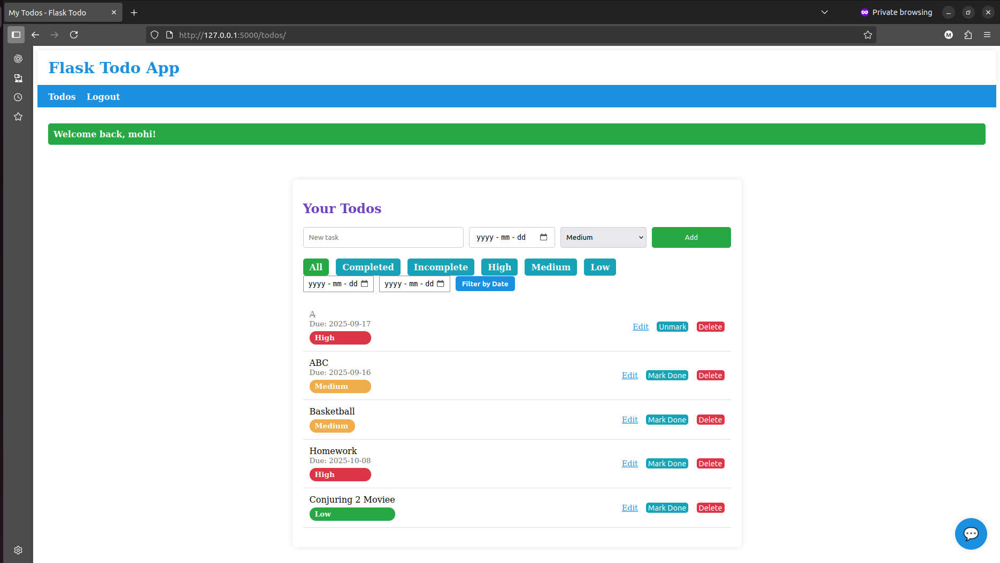
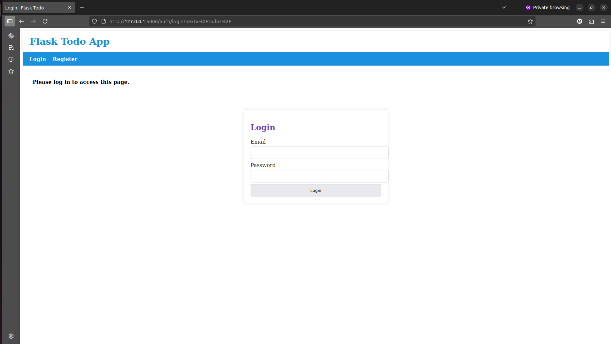
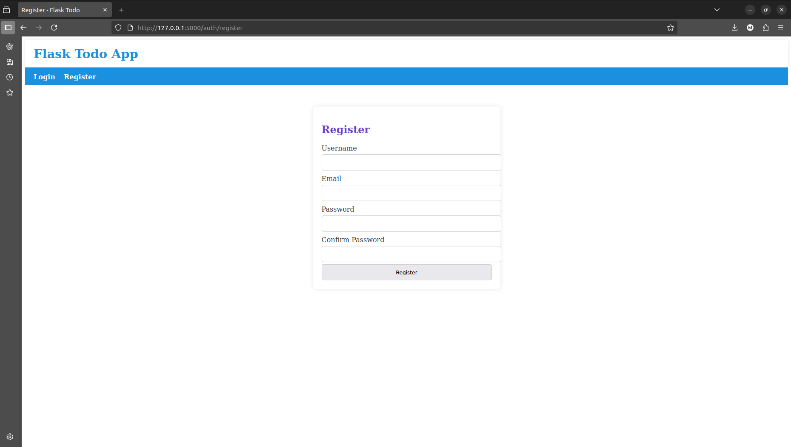
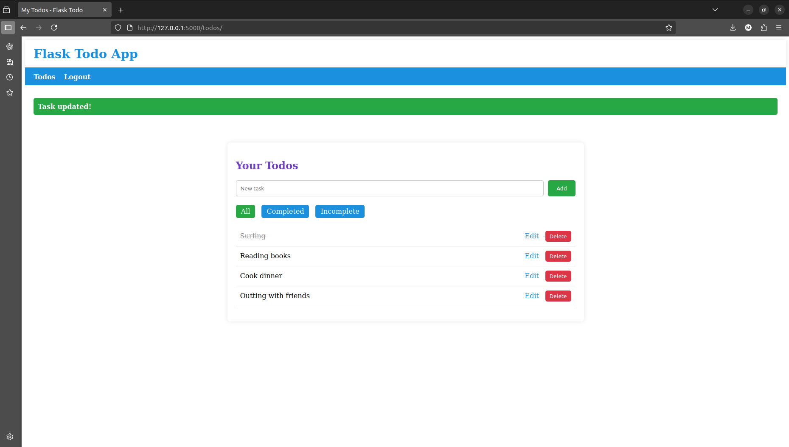
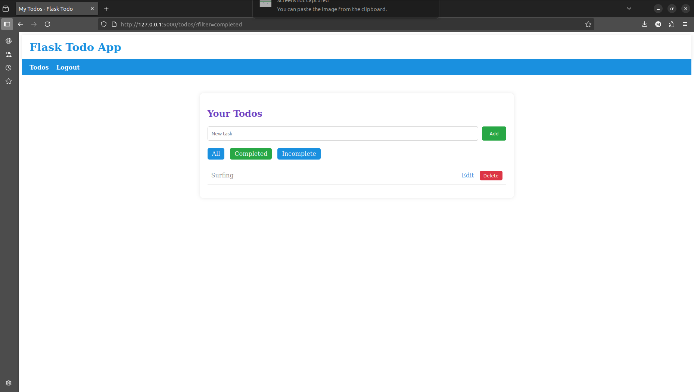
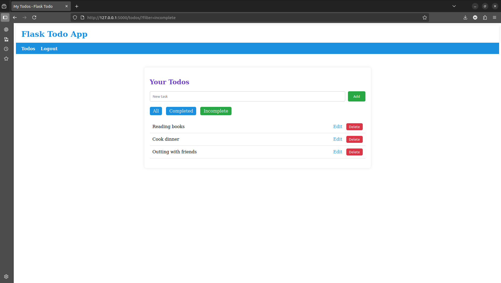

# ✅ Flask Todo App

A full-stack **Todo list application** built with **Flask**, featuring:

- User authentication (register, login, logout)  
- Task management (create, read, update, delete)  
- Filtering by **completed / incomplete / all**  
- Flash messages for success & errors  
- SCSS support with **Flask-Assets** (modular, per-blueprint styles)  
- Blueprints for a clean and scalable project structure  

---

## 📂 Project Structure

```
flask_todo/
├─ app/
│  ├─ __init__.py          # App factory, blueprint registration
│  ├─ extensions.py        # Flask extensions (db, migrate, login, assets)
│  ├─ models/              # SQLAlchemy models
│  │   ├─ user.py
│  │   └─ task.py
│  ├─ auth/                # Auth blueprint
│  │   ├─ routes.py
│  │   └─ forms.py
│  ├─ todo/                # Todo blueprint
│  │   ├─ routes.py
│  ├─ main/                # Main blueprint (homepage, base)
│  ├─ templates/           # Jinja2 templates
│  │   ├─ base.html
│  │   ├─ auth/
│  │   └─ todos/
│  └─ static/
│      ├─ scss/            # SCSS files
│      │   ├─ _variables.scss
│      │   ├─ main/main.scss
│      │   ├─ auth/auth.scss
│      │   └─ todo/todo.scss
│      └─ css/             # Compiled CSS (output)
├─ migrations/             # Alembic migrations
├─ config.py               # Config classes (Dev, Prod)
├─ wsgi.py                 # Entry point
├─ .env                    # Environment variables
├─ requirements.txt        # Python dependencies
└─ README.md
```

---

## 🚀 Features

- 🔑 **Authentication** — register/login/logout with secure password hashing  
- 📝 **Todo CRUD** — add, edit, delete, and toggle tasks  
- 🔍 **Filtering** — view completed, incomplete, or all tasks  
- 🎨 **Styling** — modular SCSS per blueprint (`auth.scss`, `todo.scss`, `main.scss`)  
- ⚡ **Flash messages** — success, error, and info feedback  
- 🗄️ **SQLite with SQLAlchemy** + migrations via Alembic  

---

## ⚙️ Setup Instructions

### 1. Clone the repository
```bash
git clone https://github.com/yourusername/flask-todo.git
cd flask-todo
```

### 2. Create a virtual environment
```bash
python -m venv .venv
source .venv/bin/activate   # Linux/Mac
.venv\Scripts\activate      # Windows
```

### 3. Install dependencies
```bash
pip install -r requirements.txt
```

### 4. Environment variables (`.env`)
Create a `.env` file in the project root:
```bash
FLASK_APP=wsgi.py
FLASK_ENV=development
SECRET_KEY=supersecretkey
SQLALCHEMY_DATABASE_URI=sqlite:///app.db
```

### 5. Initialize the database
```bash
flask db init
flask db migrate -m "Initial migration"
flask db upgrade
```

### 6. Run the app
```bash
flask run
```

Go to 👉 http://127.0.0.1:5000/

---

## 🎨 SCSS Workflow

SCSS files live in `app/static/scss/`.  
They are compiled automatically with **Flask-Assets** into `app/static/css/`.

Bundles:
- `main.scss` → `main.min.css` (navbar, flash, global)
- `auth.scss` → `auth.min.css` (login/register pages)
- `todo.scss` → `todo.min.css` (todo list pages)

---

## 📸 Screenshots

### Landing Page


### Login Page


### Register Page


### Todo List – All Tasks


### Todo List – Completed Tasks


### Todo List – Incomplete Tasks


---

## 🛠 Tech Stack

- [Flask](https://flask.palletsprojects.com/) — web framework  
- [Flask-SQLAlchemy](https://flask-sqlalchemy.palletsprojects.com/) — ORM  
- [Flask-Migrate](https://flask-migrate.readthedocs.io/) — Alembic migrations  
- [Flask-Login](https://flask-login.readthedocs.io/) — session management  
- [Flask-Assets](https://flask-assets.readthedocs.io/) — SCSS/CSS bundling  
- [WTForms](https://wtforms.readthedocs.io/) — form handling  

---

## 📌 Future Improvements

- 🌙 Dark mode toggle  
- 🔍 Search tasks by keyword  
- 📱 Responsive navbar (mobile friendly)  
- 📡 JSON API with JWT authentication  

---

## 📝 License
This project is licensed under the MIT License — see the [LICENSE](LICENSE) file for details.